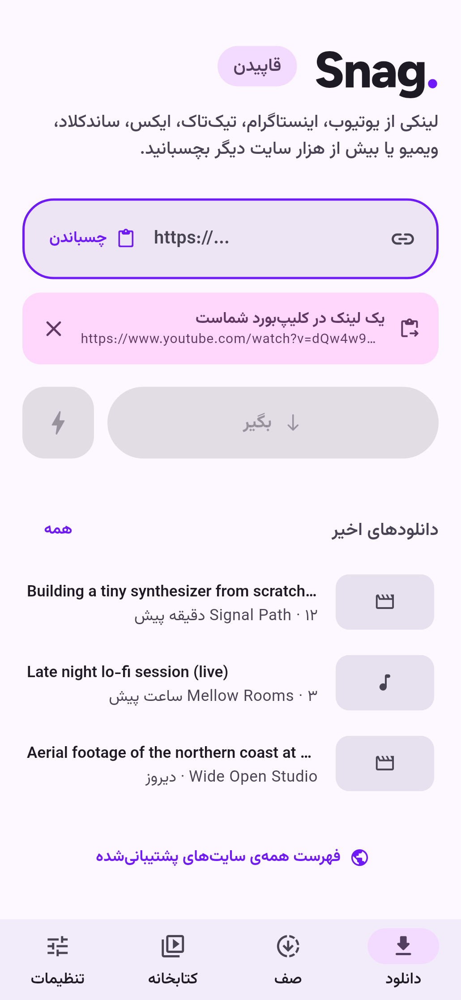
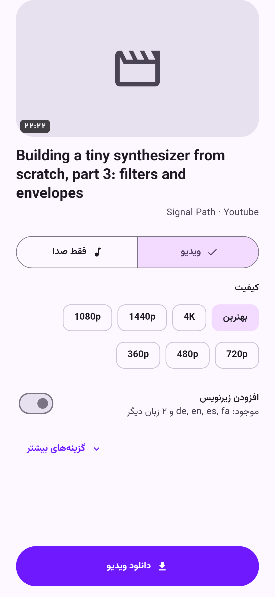

<div dir="rtl">

<p align="center">
  
</p>

<h1 align="center">Snag</h1>

<p align="center"><a href="README.md">English</a> · <b>فارسی</b></p>

<p align="center">
  <b>لینک را بچسبانید، فایل را بگیرید.</b><br>
  یک دانلودر کوچک، رایگان و متن‌باز ویدیو و صدا برای لینوکس، ویندوز، مک و اندروید.<br>
  با قدرت <a href="https://github.com/yt-dlp/yt-dlp">yt-dlp</a>، پس با بیش از هزار سایت کار می‌کند.
</p>

<p align="center">
  <a href="https://github.com/SalehTZ/snag/releases"></a>
  <a href="LICENSE"></a>
  <a href="#حمایت-از-snag"></a>
</p>

<p align="center">
  
  
  
</p>

---

## چرا Snag؟

بیشتر دانلودرها یا یک دستور ترمینالی‌اند یا صفحه‌ای پر از تبلیغ. Snag همان چیزی است که از بچگی می‌خواستم: **یک جعبه، یک دکمه، تمام.** اگر بیشتر لازم داشتید، همه‌چیز فقط یک ضربه دورتر است.

- **یک جعبه، یک دکمه.** لینک را بچسبانید یا روی پنجره رها کنید. Snag لینکی را که کپی کرده‌اید خودش پیدا می‌کند.
- **ویدیو یا صدا.** کیفیت را انتخاب کنید (تا 4K) یا صدا را به‌صورت MP3، M4A، Opus یا FLAC بگیرید.
- **همه‌جا پخش می‌شود.** به‌طور پیش‌فرض H.264 و AAC در قالب MP4 انتخاب می‌شود تا فایل روی هر دستگاهی پخش شود.
- **پلی‌لیست کامل.** با «انتخاب همه» یا تک‌تک، هر چه می‌خواهید بردارید.
- **یک صف واقعی.** سرعت، زمان باقی‌مانده و حجم را زنده ببینید؛ لغو، تلاش دوباره و تعداد دانلود هم‌زمان قابل تنظیم است.
- **کتابخانه.** همه‌ی دانلودهایتان را جستجو کنید، باز کنید، در پوشه نشان دهید یا دوباره دانلود کنید.
- **امکانات خوب.** اطلاعات فایل، کاور، فصل‌ها و زیرنویس داخل فایل قرار می‌گیرند. SponsorBlock می‌تواند بخش‌های تبلیغاتی را علامت بزند یا حذف کند.
- **ابزارهای حرفه‌ای، هر وقت خواستید.** انتخاب فرمت دقیق، **الگوهای فرمان** ذخیره‌شده با پرچم‌های خام yt-dlp، آرگومان‌های اضافه، کوکی (از فایل یا مستقیم از مرورگر)، پروکسی، محدودیت سرعت و aria2c.
- **طراحی Material 3 Expressive.** رنگ‌های تصویر زمینه یا رنگ اصلی سیستم، حالت روشن و تیره و حرکت‌های فنری که به تنظیم «کاهش حرکت» احترام می‌گذارند.
- **به زبان شما.** انگلیسی و فارسی داخل برنامه‌اند، با چیدمان کامل راست‌به‌چپ، اعداد فارسی و تقویم شمسی. زبان‌های دیگر را جامعه اضافه می‌کند و افزودن هر زبان فقط [یک فایل](TRANSLATING.md) است.
- **به شما احترام می‌گذارد.** بدون تبلیغ، بدون ردیابی، بدون حساب کاربری. فایل‌هایتان از دستگاهتان بیرون نمی‌روند.

## دانلود

آخرین نسخه را از **[Releases](https://github.com/SalehTZ/snag/releases)** بگیرید:

| سیستم‌عامل | فایل |
|---|---|
| اندروید | `snag-<version>-arm64-v8a.apk` (بیشتر گوشی‌ها)، `armeabi-v7a` برای گوشی‌های قدیمی‌تر |
| ویندوز | `snag-<version>-windows-x64.zip`؛ از حالت فشرده خارج کنید و `snag.exe` را اجرا کنید |
| مک | `snag-<version>-macos.zip`؛ بار اول روی برنامه راست‌کلیک کنید و **Open** را بزنید (هنوز notarize نشده) |
| لینوکس | `snag-<version>-linux-x64.tar.gz`؛ از حالت فشرده خارج کنید و `./snag` را اجرا کنید |

روی دسکتاپ، Snag در اولین اجرا نسخه‌های رسمی **yt-dlp**، **ffmpeg** و **Deno** را دریافت می‌کند. همه‌شان داخل پوشه‌ی خود برنامه می‌مانند و چیزی روی سیستم نصب نمی‌شود. yt-dlp را می‌توانید با یک کلیک از **تنظیمات › اجزا** به‌روز کنید؛ این مهم است چون سایت‌ها مدام تغییر می‌کنند. روی اندروید همه‌چیز داخل برنامه است.

## حمایت از Snag

Snag رایگان است و رایگان می‌ماند: نه تبلیغ، نه دیوار پرداخت، نه نسخه‌ی «پرو». اگر وقتتان را صرفه‌جویی کرده، لطفاً به حمایت فکر کنید. کمک‌های شما هزینه‌ی سرورهای ساخت، گواهی‌های امضای کد (تا مک و ویندوز دیگر هشدار ندهند) و ساعت‌هایی را می‌پردازد که صرف هماهنگ ماندن با سایت‌های همیشه‌در‌حال‌تغییر می‌شود.

<a href="https://github.com/sponsors/SalehTZ"></a>
<a href="https://ko-fi.com/salehtz"></a>

**ارز دیجیتال**، به ترتیب کمترین کارمزد. فقط روی همان شبکه‌ای که نوشته شده بفرستید؛ ارزی که روی شبکه‌ی دیگری فرستاده شود ممکن است برای همیشه از دست برود. (داخل برنامه هم دکمه‌ی کپی برای هر آدرس هست: تنظیمات › درباره › ارز دیجیتال.)

| شبکه | در صرافی انتخاب کنید | ارسال | آدرس |
|---|---|---|---|
| **BNB Smart Chain** (کمترین کارمزد) | `BSC` / `BEP20` | BNB، USDT | `0xDc131f09a194957EAdD1c069765BF9e78013Ac8C` |
| **ترون** | `TRON` / `TRC20` | TRX، USDT | `TPmJbZpicJEaG9Vj5sMLBmKvzMnyn7Bkxt` |
| **اتریوم** | `ETH` / `ERC20` | ETH، USDT | `0xDc131f09a194957EAdD1c069765BF9e78013Ac8C` |
| **بیت‌کوین** | `BTC` (SegWit، آدرس با `bc1` شروع می‌شود) | BTC | `bc1qahd3arfp90rpny73dp9unjhcdl32mmnkrln7uy` |

<details>
<summary>از کدام شبکه استفاده کنم؟</summary>

- **BNB Smart Chain (BSC، BEP20)**: شبکه‌ی بایننس؛ ارزان‌ترین گزینه‌ی اینجا، معمولاً چند سنت. با «BNB Beacon Chain» یا «opBNB» یکی نیست.
- **ترون (TRC20)**: رایج‌ترین شبکه برای USDT، به‌ویژه در صرافی‌های ایرانی. ارسال USDT حدود ۱ دلار کارمزد دارد، مگر اینکه کیف پولتان TRX استیک کرده باشد.
- **اتریوم (ERC20)**: شبکه‌ی اصلی قراردادهای هوشمند. این روزها اغلب ارزان است، ولی در زمان شلوغی کارمزدش بالا می‌رود.
- **بیت‌کوین**: اولین ارز دیجیتال. کارمزد به شلوغی شبکه بستگی دارد و از بقیه کندتر است.

آدرس BNB Smart Chain و اتریوم یکی است و این طبیعی است، چون هر دو شبکه از یک قالب آدرس استفاده می‌کنند. فقط مطمئن شوید شبکه‌ای که انتخاب می‌کنید با همان ردیفی که آدرس را از آن کپی کرده‌اید یکی باشد.
</details>

رایگان هم می‌توانید کمک کنید:
- ⭐ **به مخزن ستاره بدهید.** به دیگران کمک می‌کند Snag را پیدا کنند.
- 🐛 **سایت‌های خراب را گزارش کنید** و گزارش (لاگ) صفحه‌ی جزئیات دانلود را پیوست کنید.
- 🌍 **Snag را به زبان خودتان ترجمه کنید.** فقط [یک فایل](TRANSLATING.md) است.
- 💜 **به [yt-dlp](https://github.com/yt-dlp/yt-dlp) هم ستاره بدهید.** Snag بدون آن هیچ است.

## خودتان بسازید

به [Flutter](https://docs.flutter.dev/get-started/install) نسخه‌ی 3.47 یا جدیدتر نیاز دارید.

<div dir="ltr">

```bash
git clone https://github.com/SalehTZ/snag.git
cd snag
flutter pub get

flutter run -d linux        # or windows, macos
flutter run -d <android-id> # a phone or emulator

# Release builds
flutter build apk --release --split-per-abi
flutter build linux --release
flutter build windows --release
flutter build macos --release
```

</div>

### تست‌ها

<div dir="ltr">

```bash
flutter test                                     # unit tests (args, parsing, models, translations)
flutter test tool/e2e                            # real downloads through the desktop engine (needs network)
flutter test tool/screenshots --update-goldens   # renders every screen, English and Persian
flutter test tool/icon --update-goldens && dart run flutter_launcher_icons   # regenerate the app icon
```

</div>

## چطور کار می‌کند

<div dir="ltr">

```
UI (Flutter, Riverpod)
  └─ DownloadManager: queue, concurrency, history
       └─ YtDlpEngine: one interface, shared args and parsing
            ├─ DesktopEngine: spawns the yt-dlp binary (Linux / Windows / macOS)
            └─ AndroidEngine: Kotlin bridge to youtubedl-android (embedded Python, ffmpeg, QuickJS)
```

</div>

ترفندی که برنامه را کوچک نگه می‌دارد: Snag از yt-dlp می‌خواهد **پیشرفت دانلود را به شکل ماشین‌خوان** چاپ کند (`--progress-template "download:SNAG_P%(progress)j"` و `--print after_move:...` برای مسیر نهایی فایل). هر دو پلتفرم فقط خط‌های خروجی را به یک تجزیه‌گر Dart می‌فرستند، یعنی `lib/engine/output_parser.dart`، که تست واحد دارد. همه‌ی پرچم‌ها هم از یک تابع خالص می‌آیند، یعنی `lib/engine/args_builder.dart`، که آن هم تست دارد.

| مسیر | چه چیزی آنجاست |
|---|---|
| `lib/engine/` | آرگومان‌های yt-dlp، تجزیه‌ی خروجی، موتورهای دسکتاپ و اندروید، مدیریت فایل‌های اجرایی |
| `lib/features/` | صفحه‌ی اصلی، گزینه‌های دانلود، صف، کتابخانه، تنظیمات، الگوها و راه‌اندازی اولیه |
| `lib/core/theme/` | تم Material 3 Expressive و حرکت‌های فنری |
| `lib/l10n/` | ترجمه‌ها (`app_<locale>.arb`) و قالب‌بندی متناسب با زبان |
| `android/app/src/main/kotlin/` | `YtDlpBridge`، `DownloadService` و دریافت لینک از «اشتراک‌گذاری» |

## مشارکت

درخواست‌های ادغام (PR) خوش‌آمدند! [CONTRIBUTING.md](CONTRIBUTING.md) را ببینید و اگر می‌خواهید زبان خودتان را اضافه کنید، [TRANSLATING.md](TRANSLATING.md) را. اگر سایتی کار نمی‌کند، اول **تنظیمات › اجزا › به‌روزرسانی** را امتحان کنید (یا نسخه‌ی شبانه‌ی yt-dlp را روشن کنید). بیشتر خرابی‌ها ظرف چند روز در خود yt-dlp رفع می‌شوند.

## نکات حقوقی

Snag یک رابط کاربری برای yt-dlp است و خودش چیزی را میزبانی، پراکسی یا دور نمی‌زند. **فقط محتوایی را دانلود کنید که حق دانلودش را دارید** و به قوانین هر سایت و قوانین کشورتان احترام بگذارید.

Snag تحت مجوز **[GNU GPL v3](LICENSE)** منتشر می‌شود. از [Seal](https://github.com/JunkFood02/Seal) (یک برنامه‌ی عالی مخصوص اندروید) الهام گرفته اما هیچ کدی با آن مشترک ندارد. اجزای سازنده‌اش:
- [yt-dlp](https://github.com/yt-dlp/yt-dlp)، Unlicense
- [youtubedl-android](https://github.com/yausername/youtubedl-android)، GPL-3.0
- [FFmpeg](https://ffmpeg.org)، نسخه‌های GPL از [yt-dlp/FFmpeg-Builds](https://github.com/yt-dlp/FFmpeg-Builds)
- [Deno](https://deno.com)، MIT
- فونت‌های [Figtree](https://github.com/erikdkennedy/figtree) و [وزیرمتن](https://github.com/rastikerdar/vazirmatn)، SIL OFL 1.1

</div>
