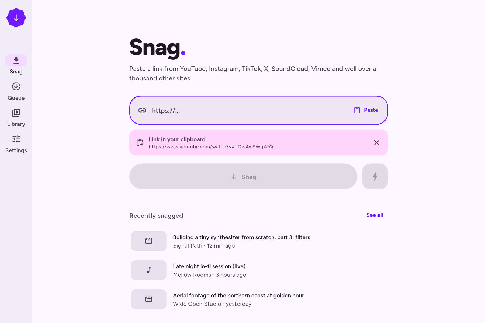
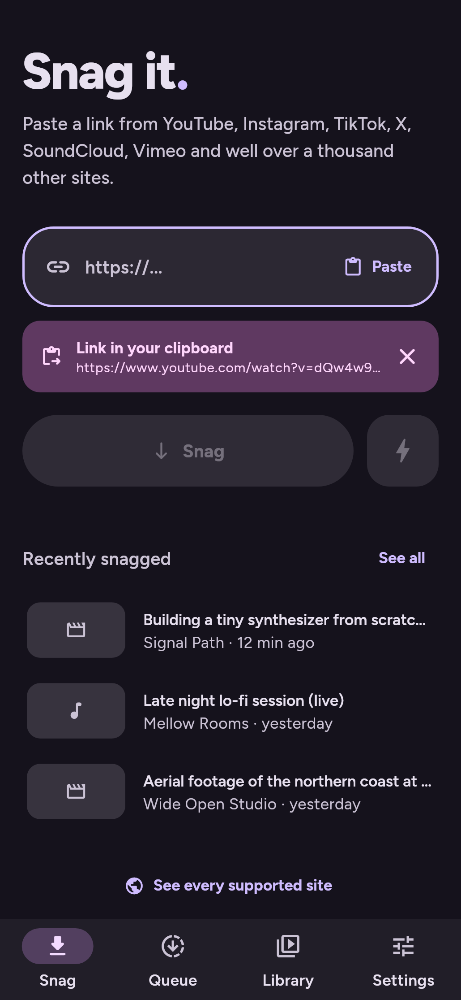
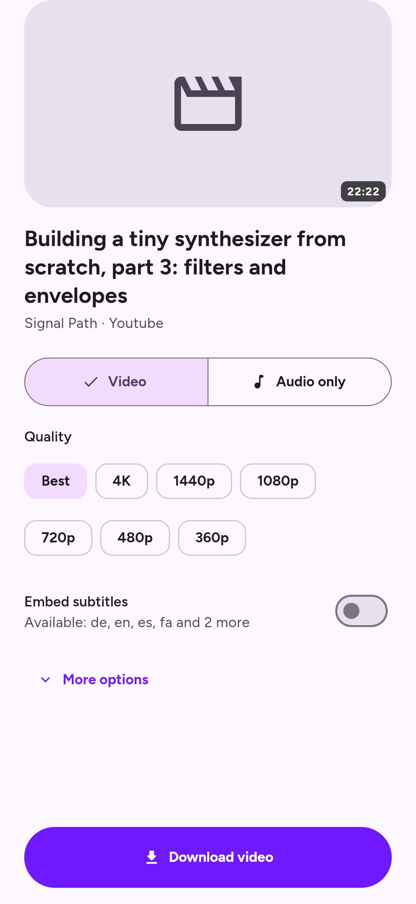
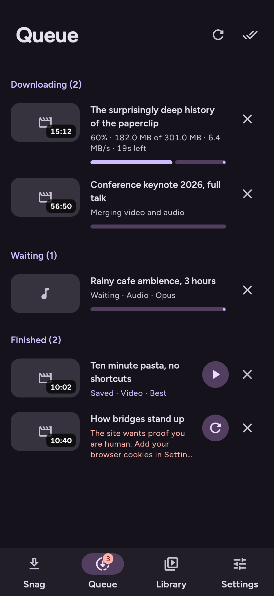

<p align="center">
  
</p>

<h1 align="center">Snag</h1>

<p align="center"><b>English</b> · <a href="README.fa.md">فارسی</a></p>

<p align="center">
  <b>Paste a link. Get the file.</b><br>
  A tiny, free and open source video &amp; audio downloader for Linux, Windows, macOS and Android.<br>
  Powered by <a href="https://github.com/yt-dlp/yt-dlp">yt-dlp</a>, so it works with well over a thousand sites.
</p>

<p align="center">
  <a href="https://github.com/SalehTZ/snag/releases"></a>
  <a href="LICENSE"></a>
  <a href="#support-snag"></a>
</p>

<p align="center">
  
</p>

<p align="center">
  
  
  
</p>

---

## Why Snag?

Most downloaders are either a terminal command or a page full of ads. Snag is the one I wanted as a kid: **one box, one button, done.** If you need more, it's all there one tap away.

- **One box, one button.** Paste a link or drop it on the window. Snag spots links you've already copied.
- **Video or audio.** Pick a quality (up to 4K) or extract MP3, M4A, Opus or FLAC.
- **Plays everywhere.** By default it picks H.264 + AAC in MP4, so your files just play.
- **Whole playlists.** Choose which items to grab with select all/none.
- **A real queue.** Live speed, ETA and size; cancel, retry, and a configurable number of parallel downloads.
- **Library.** Search everything you've downloaded, open it, show it in its folder, or grab it again.
- **Nice extras.** Embedded metadata, cover art, chapters and subtitles. SponsorBlock can mark or cut sponsor segments.
- **Power tools when you want them.** An exact format picker, saved **command templates** with raw yt-dlp flags, extra arguments, cookies (file or straight from your browser), proxy, speed limit and aria2c.
- **Material 3 Expressive design.** Wallpaper or accent colors, light/dark themes and springy motion that respects reduced-motion settings.
- **Speaks your language.** English and فارسی are built in, with full right-to-left layout, Persian digits and the Solar Hijri calendar. Every other language comes from the community, and adding one takes [a single file](TRANSLATING.md).
- **Respects you.** No ads, no tracking, no accounts. Your files never leave your device.

## Download

Grab the latest build from **[Releases](https://github.com/SalehTZ/snag/releases)**:

| Platform | File |
|---|---|
| Android | `snag-<version>-arm64-v8a.apk` (most phones), `armeabi-v7a` for older ones |
| Windows | `snag-<version>-windows-x64.zip`, unzip and run `snag.exe` |
| macOS | `snag-<version>-macos.zip`. The first time, right-click the app and choose **Open** (it isn't notarized yet) |
| Linux | `snag-<version>-linux-x64.tar.gz`, extract and run `./snag` |

On desktop, Snag fetches the official **yt-dlp**, **ffmpeg** and **Deno** binaries the first time it runs. It stores them in its own app folder and never installs anything system-wide. You can update yt-dlp from **Settings > Components** with one click, which matters because sites change often. On Android everything is bundled.

## Support Snag

Snag is free and always will be: no ads, no paywalls, no "pro" version. If it saved you time, please consider chipping in. Donations pay for build machines, code signing certificates (so macOS and Windows stop warning you) and the hours spent keeping up with sites that keep changing.

<a href="https://github.com/sponsors/SalehTZ"></a>
<a href="https://ko-fi.com/salehtz"></a>

**Crypto**, listed cheapest network first. Send only on the network shown; coins sent on a different network can be lost for good. (The app has a copy button for each address: Settings > About > Crypto.)

| Network | On exchanges, pick | Send | Address |
|---|---|---|---|
| **BNB Smart Chain** (lowest fees) | `BSC` / `BEP20` | BNB, USDT | `0xDc131f09a194957EAdD1c069765BF9e78013Ac8C` |
| **Tron** | `TRON` / `TRC20` | TRX, USDT | `TPmJbZpicJEaG9Vj5sMLBmKvzMnyn7Bkxt` |
| **Ethereum** | `ETH` / `ERC20` | ETH, USDT | `0xDc131f09a194957EAdD1c069765BF9e78013Ac8C` |
| **Bitcoin** | `BTC` (SegWit, address starts with `bc1`) | BTC | `bc1qahd3arfp90rpny73dp9unjhcdl32mmnkrln7uy` |

<details>
<summary>Which network should I use?</summary>

- **BNB Smart Chain (BSC, BEP20)**: Binance's network. The cheapest here, usually a few cents. Not the same as "BNB Beacon Chain" or "opBNB".
- **Tron (TRC20)**: the most widely supported network for USDT, especially on Iranian exchanges. Sending USDT costs around $1 unless your wallet has staked TRX.
- **Ethereum (ERC20)**: the original smart-contract network. Often cheap lately, but fees can jump when it's busy.
- **Bitcoin**: the original. Fees vary with network load, and it's slower than the others.

The BNB Smart Chain and Ethereum addresses are the same. That's normal: both networks use the same address format. Just make sure the network you pick matches the row you're copying from.
</details>

You can also help for free:
- ⭐ **Star the repo.** It helps other people find Snag.
- 🐛 **Report broken sites** with the log from the download's details sheet.
- 🌍 **Translate** Snag into your language. It takes [one file](TRANSLATING.md).
- 💜 **Star [yt-dlp](https://github.com/yt-dlp/yt-dlp)** too. Snag would be nothing without it.

## Build it yourself

You need [Flutter](https://docs.flutter.dev/get-started/install) 3.47 or newer.

```bash
git clone https://github.com/SalehTZ/snag.git
cd snag
flutter pub get

flutter run -d linux        # or windows, macos
flutter run -d <android-id> # a phone or emulator

# Release builds
flutter build apk --release --split-per-abi
flutter build linux --release
flutter build windows --release
flutter build macos --release
```

### Tests

```bash
flutter test                                     # unit tests (args, parsing, models)
flutter test tool/e2e                            # real downloads through the desktop engine (needs network)
flutter test tool/screenshots --update-goldens   # renders every screen to tool/screenshots/goldens
flutter test tool/icon --update-goldens && dart run flutter_launcher_icons   # regenerate the app icon
```

## How it works

```
UI (Flutter, Riverpod)
  └─ DownloadManager: queue, concurrency, history
       └─ YtDlpEngine: one interface, shared args and parsing
            ├─ DesktopEngine: spawns the yt-dlp binary (Linux / Windows / macOS)
            └─ AndroidEngine: Kotlin bridge to youtubedl-android (embedded Python, ffmpeg, QuickJS)
```

The trick that keeps it small: Snag asks yt-dlp to print **machine-readable progress** (`--progress-template "download:SNAG_P%(progress)j"`, plus `--print after_move:...` for the final path). Both platforms just stream raw output lines into a single Dart parser, `lib/engine/output_parser.dart`, which has unit tests. All the flags come from one pure function, `lib/engine/args_builder.dart`, which is also unit-tested.

| Path | What lives there |
|---|---|
| `lib/engine/` | yt-dlp args, output parsing, desktop/Android engines, binary manager |
| `lib/features/` | Home, download sheet, queue, library, settings, templates, first-run setup |
| `lib/core/theme/` | Material 3 Expressive theme and spring motion |
| `lib/l10n/` | Translations (`app_<locale>.arb`) and locale-aware formatting |
| `android/app/src/main/kotlin/` | `YtDlpBridge`, `DownloadService`, share intent |

## Contributing

PRs are welcome! See [CONTRIBUTING.md](CONTRIBUTING.md), and [TRANSLATING.md](TRANSLATING.md) if you'd like to add your language. If a site is broken, first try **Settings > Components > Update** (or switch on nightly yt-dlp). Most breakages are fixed upstream within days.

## Legal

Snag is a front-end for yt-dlp. It doesn't host, proxy or circumvent anything itself. **Only download content you have the right to download**, and respect each site's terms and your local laws.

Snag is licensed under the **[GNU GPL v3](LICENSE)**. It is inspired by [Seal](https://github.com/JunkFood02/Seal) (an excellent Android-only app) but shares no code with it. Its building blocks:
- [yt-dlp](https://github.com/yt-dlp/yt-dlp), Unlicense
- [youtubedl-android](https://github.com/yausername/youtubedl-android), GPL-3.0
- [FFmpeg](https://ffmpeg.org), GPL builds from [yt-dlp/FFmpeg-Builds](https://github.com/yt-dlp/FFmpeg-Builds)
- [Deno](https://deno.com), MIT
- [Figtree](https://github.com/erikdkennedy/figtree) and [Vazirmatn](https://github.com/rastikerdar/vazirmatn) fonts, SIL OFL 1.1
